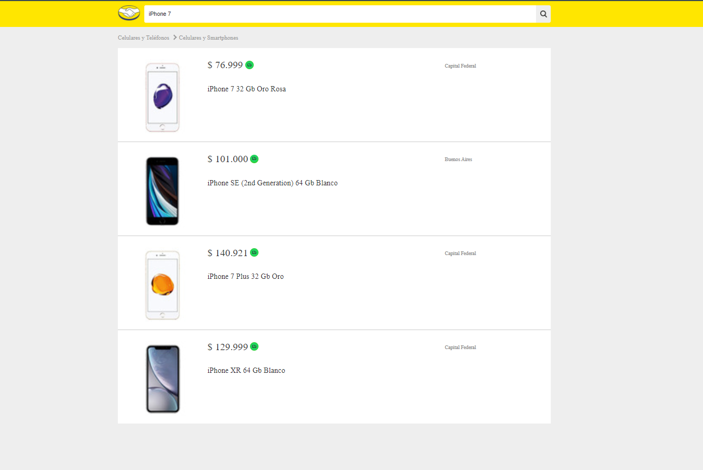
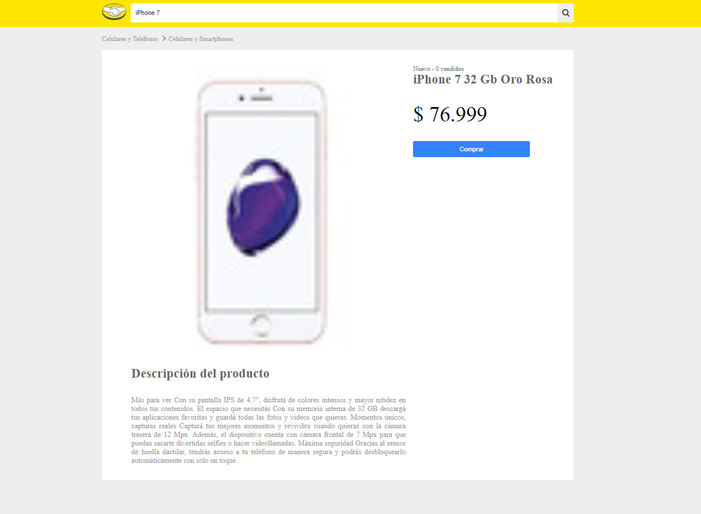

# Challenge Clone Mercado Libre

App Challenge Clone Mercado Libre integrada con los siguientes endpoints:

## Obtener listado de articulos

`Obtener listado de articulos por una busqueda` [https://api-clone-mercado-libre.vercel.app/api/items?q=bicicleta](https://api-clone-mercado-libre.vercel.app/api/items?q=bicicleta).

## Obtener articulo por Id

`Obtener articulo por Id` [https://api-clone-mercado-libre.vercel.app/api/items/MLA624303034](https://api-clone-mercado-libre.vercel.app/api/items/MLA624303034).

## Captura busqueda de articulos

## Captura detalle de articulo

`Ver la aplicación en:` [http://clone-mercado-libre-git-main.georgerangelcode.vercel.app/](http://clone-mercado-libre-git-main.georgerangelcode.vercel.app/)

## ¿Cómo funciona?

Requiere Node.JS > 10

- `npm install` para instalar las dependencias
- `npm run start` para iniciar el entorno de desarrollo
- `npm run build` para generar app para entorno de producción

## Licencia

MIT
